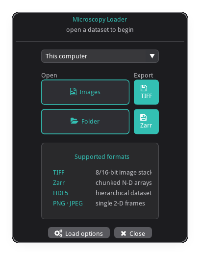

# imgui_data_loader

A themed, configurable **file / folder open dialog** widget, built on
**imgui-file-dialog** and [imgui-bundle](https://github.com/pthom/imgui_bundle).

It gives you:

- a small, styled **launcher window** — your title, help/info content, and
  buttons that open the **OS-native** picker (via `portable_file_dialogs`)
- configurable buttons — open a file, many files, a folder, or save
- customizable file-type filters, theme, an info card, and an options popup
- one-shot use that returns the picked path, or embed it as a panel in a larger app

<p align="center">
  <a href="examples/dialog_full_example.py">
    
  </a>
</p>

<p align="center">
  See the full example code here:
  <a href="examples/dialog_full_example.py"><code>examples/dialog_full_example.py</code></a>
</p>

## Install

```bash
pip install imgui_data_loader
```

The only dependency is `imgui-bundle` (which provides imgui, hello_imgui,
immapp, portable_file_dialogs and the FontAwesome icon font).

## Quick start

```python
from imgui_data_loader import run_file_dialog, FileDialogConfig

result = run_file_dialog(FileDialogConfig())   # default Open File(s) / Select Folder

if result:                      # truthy only for a real selection
    print(result.paths)         # list[str]
    print(result.path)          # first path, or None
else:
    print("cancelled")
```

`run_file_dialog` opens the window, blocks until the user picks something or
quits, and returns a `DialogResult`.

## Examples

Runnable scripts in [`examples/`](examples/) — run them on a desktop session
(`python examples/dialog_minimal.py`).

| name | file | shows |
|------|------|-------|
| dialog_minimal | [`dialog_minimal.py`](examples/dialog_minimal.py) | the one call — `run_file_dialog()` with defaults, reading the `DialogResult` |
| dialog_full_example | [`dialog_full_example.py`](examples/dialog_full_example.py) | the screenshot above — a source selector, a two-column action grid (`dlg.pick`), a formats panel with recent files, a custom `Theme`, a load-options popup, persistence, and callbacks |
| dialog_themes | [`dialog_themes.py`](examples/dialog_themes.py) | a light `Theme` in a resized window, with hand-placed UI — an anchored popup (`set_next_window_pos`) and a right-aligned action via the cursor API, through `footer_draw` |

## What you can do with imgui is endless

The callback slots (`header_draw`, `top_draw`, `info`, `options_draw`,
`footer_draw`) all run inside a live imgui frame, so any widget **bundled with
imgui-bundle** works — animated toggles, rotary knobs, spinners, markdown,
command palettes, cool bars, and the rest. Pair them with the library's themed
helpers (`center_text`, `icon_button`, `push_button_style`, …) and `dlg.theme`
to match the styling. For a sense of just how far plain imgui goes, browse
[this long thread of community examples](https://github.com/ocornut/imgui/issues/3488#issuecomment-698634017).

## Configuration reference

`FileDialogConfig` fields:

| field | default | purpose |
|-------|---------|---------|
| `title`, `subtitle` | `"Open Data"`, `""` | header text |
| `buttons` | Open File(s) + Select Folder | list of `ButtonSpec` |
| `filetypes` | `[All Files]` | default filters for file/save buttons |
| `default_dir` | `""` | picker start dir (else persistence, else `~`) |
| `theme` | `Theme.dark()` | colors |
| `header_draw` | `None` | replace the title/subtitle block |
| `top_draw` | `None` | content between header and buttons |
| `info` | `None` | callback(s) drawn in the info card |
| `options_draw` | `None` | Options popup content (also toggles the button) |
| `footer_draw` | `None` | replace the Options/Quit row |
| `options_label` | `"Options"` | popup + button label |
| `show_options_button` | `True` | show Options (needs `options_draw`) |
| `show_quit_button`, `quit_label` | `True`, `"Quit"` | Quit button |
| `quit_on_escape` | `True` | Esc cancels |
| `close_on_select` | `True` | exit the run loop after a pick (one-shot mode) |
| `window_title`, `window_size`, `resizable` | — | OS window (one-shot) |
| `ini_path` | `~/.config/imgui_data_loader/…` | where the layout `.ini` is saved |
| `assets_folder` | imgui-bundle's | folder providing the icon font |
| `persistence` | `None` | a `PreferenceStore` |
| `on_select`, `on_cancel` | `None` | result callbacks |

## Notes

- Buttons open the **OS-native** dialog, so a desktop session is required (no
  in-window file browser).
- Icons come from FontAwesome 6 (**Solid** only), which ships inside
  imgui-bundle; a few non-solid glyphs render as a blank box — pick a solid icon
  if one shows empty.
- Draw callbacks run inside an active imgui frame — only call imgui from them.

## License

MIT
