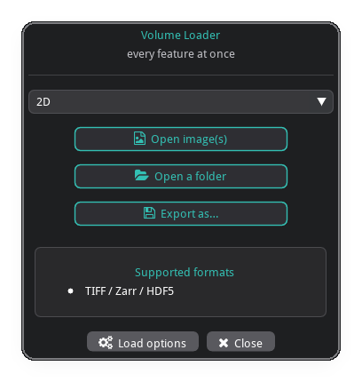
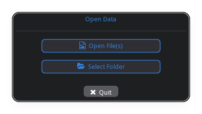
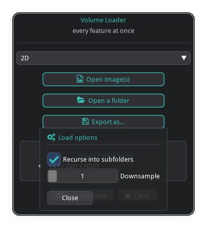
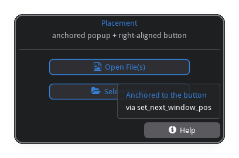

# imgui_data_loader

A themed, configurable **file / folder open dialog** for
[imgui-bundle](https://github.com/pthom/imgui_bundle).

It builds on the pieces imgui-bundle already ships —
[imgui](https://github.com/ocornut/imgui) and
[hello_imgui](https://github.com/pthom/hello_imgui) for the UI, and
`portable_file_dialogs` for the **OS-native** file picker — and wraps them in a
small, styled **launcher window**: a title, your help/info content, and buttons
that open the native picker. Buttons, file types, theme, the info card, and an
options popup are all configurable. Pop it up one-shot to get back the path the
user picked, or embed the widget as one panel of a larger app.

<p align="center">
  
</p>

## Install

```bash
pip install imgui_data_loader
```

The only dependency is `imgui-bundle` (which provides imgui, hello_imgui,
immapp, portable_file_dialogs and the FontAwesome icon font).

## Quick start

```python
from imgui_data_loader import run_file_dialog, FileDialogConfig

result = run_file_dialog(FileDialogConfig())   # default Open File(s) / Select Folder

if result:                      # truthy only for a real selection
    print(result.paths)         # list[str]
    print(result.path)          # first path, or None
else:
    print("cancelled")
```

`run_file_dialog` opens the window, blocks until the user picks something or
quits, and returns a `DialogResult`.

## Examples

Three runnable scripts in [`examples/`](examples/), from the one-liner to a
config that uses every feature. The screenshots are captured from the **real**
dialogs by `python scripts/capture_docs.py` (`pip install -e ".[docs]"`, needs a
desktop session).

### 1 · Default — [`01_default.py`](examples/01_default.py)

`run_file_dialog()` with no config: an "Open File(s)" + "Select Folder" launcher
that returns a `DialogResult`.

```python
result = run_file_dialog(FileDialogConfig())
```

<p align="center">
  
</p>

### 2 · Everything — [`02_everything.py`](examples/02_everything.py)

One config that pulls in every feature: branding, custom `buttons` covering
every `PickKind` with per-button `FileType` filters, a custom `Theme`, a
`top_draw` widget row, an `info` card, an Options popup, recent-files
persistence, and result callbacks. Each imgui widget returns `(changed, value)`
— keep the value.

```python
from imgui_bundle import icons_fontawesome_6 as fa
from imgui_bundle import imgui
from imgui_data_loader import (
    run_file_dialog, FileDialogConfig, ButtonSpec, PickKind, FileType,
    Theme, JsonPreferenceStore, center_text,
)

store = JsonPreferenceStore()          # ~/.config/imgui_data_loader/recent.json
state = {"mode": 0}
MODES = ["2D", "3D volume", "Time series"]
tiff  = [FileType("TIFF", "*.tif *.tiff"), FileType("All Files", "*")]

def mode_row(dlg):                     # top_draw: a widget row above the buttons
    imgui.set_next_item_width(imgui.get_content_region_avail().x)
    _, state["mode"] = imgui.combo("##mode", state["mode"], MODES)

def info(dlg):                         # info card contents
    center_text("Supported formats", dlg.theme.accent)
    imgui.bullet_text("TIFF / Zarr / HDF5")

run_file_dialog(FileDialogConfig(
    title="Volume Loader",
    subtitle="every feature at once",
    theme=Theme.dark().replace(accent=(0.20, 0.75, 0.70, 1.0)),
    persistence=store,                 # seeds start dir + records selections
    top_draw=mode_row,
    info=info,
    buttons=[
        ButtonSpec("Open image(s)", PickKind.OPEN_FILE, icon=fa.ICON_FA_FILE_IMAGE,
                   multiselect=True, filetypes=tiff),
        ButtonSpec("Open a folder", PickKind.SELECT_FOLDER, icon=fa.ICON_FA_FOLDER_OPEN),
        ButtonSpec("Export as…", PickKind.SAVE_FILE, icon=fa.ICON_FA_FLOPPY_DISK,
                   filetypes=[FileType("Zarr", "*.zarr")]),
    ],
    on_select=lambda r: print(MODES[state["mode"]], r.paths),
    on_cancel=lambda: print("cancelled"),
))
```

<p align="center">
  
</p>

### 3 · Placement — [`03_placement.py`](examples/03_placement.py)

Use imgui to control where your own UI goes: `set_next_window_pos` anchors a
popup exactly where you want it (instead of at the mouse), and the cursor API
right-aligns a button within the row. `footer_draw` replaces the default footer
(Esc still quits).

```python
from imgui_bundle import icons_fontawesome_6 as fa
from imgui_bundle import imgui
from imgui_data_loader import (
    run_file_dialog, FileDialogConfig, push_button_style, pop_button_style,
)

def footer(dlg):
    # right-align a fixed-width button: advance the cursor by (avail - width)
    width = 130.0
    imgui.set_cursor_pos_x(
        imgui.get_cursor_pos_x() + imgui.get_content_region_avail().x - width)
    push_button_style(dlg.theme, primary=False)
    clicked = imgui.button(f"{fa.ICON_FA_CIRCLE_INFO}  Help", imgui.ImVec2(width, 0))
    pop_button_style()
    top_right = imgui.get_item_rect_max().x, imgui.get_item_rect_min().y

    if clicked:
        imgui.open_popup("##help")
    if imgui.is_popup_open("##help"):  # anchor the popup above the button
        imgui.set_next_window_pos(
            imgui.ImVec2(*top_right), imgui.Cond_.appearing, imgui.ImVec2(1.0, 1.0))
    if imgui.begin_popup("##help"):
        imgui.text_colored(dlg.theme.accent, "Anchored to the button")
        imgui.end_popup()

run_file_dialog(FileDialogConfig(title="Placement", footer_draw=footer))
```

<p align="center">
  
</p>

## What you can do with imgui is endless

The callback slots (`header_draw`, `top_draw`, `info`, `options_draw`,
`footer_draw`) all run inside a live imgui frame, so any widget **bundled with
imgui-bundle** works — animated toggles, rotary knobs, spinners, markdown,
command palettes, cool bars, and the rest. Pair them with the library's themed
helpers (`center_text`, `icon_button`, `push_button_style`, …) and `dlg.theme`
to match the styling. For a sense of just how far plain imgui goes, browse
[this long thread of community examples](https://github.com/ocornut/imgui/issues/3488#issuecomment-698634017).

## Configuration reference

`FileDialogConfig` fields:

| field | default | purpose |
|-------|---------|---------|
| `title`, `subtitle` | `"Open Data"`, `""` | header text |
| `buttons` | Open File(s) + Select Folder | list of `ButtonSpec` |
| `filetypes` | `[All Files]` | default filters for file/save buttons |
| `default_dir` | `""` | picker start dir (else persistence, else `~`) |
| `theme` | `Theme.dark()` | colors |
| `header_draw` | `None` | replace the title/subtitle block |
| `top_draw` | `None` | content between header and buttons |
| `info` | `None` | callback(s) drawn in the info card |
| `options_draw` | `None` | Options popup content (also toggles the button) |
| `footer_draw` | `None` | replace the Options/Quit row |
| `options_label` | `"Options"` | popup + button label |
| `show_options_button` | `True` | show Options (needs `options_draw`) |
| `show_quit_button`, `quit_label` | `True`, `"Quit"` | Quit button |
| `quit_on_escape` | `True` | Esc cancels |
| `close_on_select` | `True` | exit the run loop after a pick (one-shot mode) |
| `window_title`, `window_size`, `resizable` | — | OS window (one-shot) |
| `ini_path` | `~/.config/imgui_data_loader/…` | where the layout `.ini` is saved |
| `assets_folder` | imgui-bundle's | folder providing the icon font |
| `persistence` | `None` | a `PreferenceStore` |
| `on_select`, `on_cancel` | `None` | result callbacks |

## Notes

- Buttons open the **OS-native** dialog, so a desktop session is required (no
  in-window file browser).
- Icons come from FontAwesome 6 (**Solid** only), which ships inside
  imgui-bundle; a few non-solid glyphs render as a blank box — pick a solid icon
  if one shows empty.
- Draw callbacks run inside an active imgui frame — only call imgui from them.

## License

MIT
