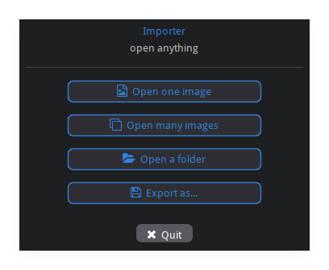
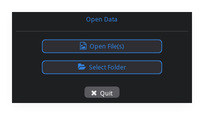
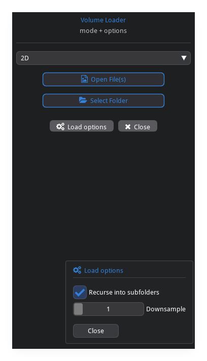
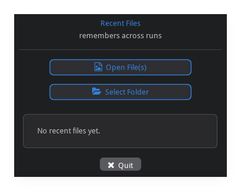
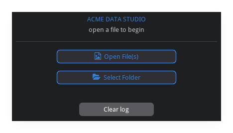

# imgui_data_loader

A themed, configurable **file / folder open dialog** for
[imgui-bundle](https://github.com/pthom/imgui_bundle). Drop it into a
[hello_imgui](https://github.com/pthom/hello_imgui) / `immapp` app, or use the
one-shot helper to pop up a launcher window and get back the path the user
picked.

It's a small, styled **launcher window** — a title, your help/info content, and
buttons that open the **OS-native** file picker (via
`portable_file_dialogs`). Everything is configurable: buttons, file types,
theme, the info card, and an options popup.

<p align="center">
  
</p>

## Install

```bash
pip install imgui_data_loader
```

The only dependency is `imgui-bundle` (which provides imgui, hello_imgui,
immapp, portable_file_dialogs and the FontAwesome icon font).

## Quick start

```python
from imgui_data_loader import run_file_dialog, FileDialogConfig

result = run_file_dialog(FileDialogConfig())   # default Open File(s) / Select Folder

if result:                      # truthy only for a real selection
    print(result.paths)         # list[str]
    print(result.path)          # first path, or None
else:
    print("cancelled")
```

`run_file_dialog` opens the window, blocks until the user picks something or
quits, and returns a `DialogResult`.

<p align="center">
  
</p>

## Examples

Full runnable scripts are in [`examples/`](examples/) — a ladder from the
one-liner above to a full embedded app; each adds options the previous one
didn't. The snippets below show the essential config; the screenshots are
captured from the **real** dialogs by `python scripts/capture_docs.py`
(`pip install -e ".[docs]"`, needs a desktop session).

### Buttons & file types

Branding, a hand-built `buttons` list covering every `PickKind`, per-button
`FileType` filters (overriding the dialog-wide default), and a `default_dir`.
`result.kind` tells you which button produced the selection.
[`examples/02_buttons_filetypes.py`](examples/02_buttons_filetypes.py)

```python
from imgui_bundle import icons_fontawesome_6 as fa
from imgui_data_loader import (
    run_file_dialog, FileDialogConfig, ButtonSpec, PickKind, FileType,
)

tiff = [FileType("TIFF", "*.tif *.tiff"), FileType("All Files", "*")]
result = run_file_dialog(FileDialogConfig(
    title="Importer",
    subtitle="open anything",
    buttons=[
        ButtonSpec("Open one image", PickKind.OPEN_FILE, icon=fa.ICON_FA_FILE_IMAGE,
                   filetypes=tiff),
        ButtonSpec("Open many images", PickKind.OPEN_FILE, icon=fa.ICON_FA_CLONE,
                   multiselect=True, filetypes=tiff),
        ButtonSpec("Open a folder", PickKind.SELECT_FOLDER, icon=fa.ICON_FA_FOLDER_OPEN),
        ButtonSpec("Export as…", PickKind.SAVE_FILE, icon=fa.ICON_FA_FLOPPY_DISK,
                   filetypes=[FileType("Zarr", "*.zarr")]),
    ],
))
print(result.kind, result.paths)   # which button fired + what it returned
```

<p align="center">
  
</p>

### Theme & info card

A custom `Theme` (start from `dark()`/`light()` and `.replace()` colors) and an
`info` card. `info` is one callback or a **list** of them — each drawn as its own
section — using the library's themed helpers (`center_text`,
`text_wrapped_colored`, `icon_button`). Each callback may take the `FileDialog`
or nothing. [`examples/03_theme_info.py`](examples/03_theme_info.py)

```python
from imgui_bundle import imgui
from imgui_data_loader import (
    run_file_dialog, FileDialogConfig, Theme, center_text, text_wrapped_colored,
)

def formats(dlg):
    center_text("Supported formats", dlg.theme.accent)
    imgui.bullet_text("TIFF / Zarr / HDF5")

def help_note(dlg):
    text_wrapped_colored(dlg.theme.text_dim,
                         "Folders load every supported file inside, sorted by name.")

run_file_dialog(FileDialogConfig(
    title="Themed Loader",
    theme=Theme.dark().replace(accent=(0.20, 0.75, 0.70, 1.0)),
    info=[formats, help_note],       # two sections in the card
))
```

<p align="center">
  
</p>

### Content slots & options popup

`top_draw` puts a widget row between the header and the buttons; `options_draw`
adds an **Options** button that opens a popup (shown open below); `on_select` /
`on_cancel` react to the outcome without inspecting the return value. Each
imgui widget returns `(changed, new_value)` — keep the value.
[`examples/04_slots_options.py`](examples/04_slots_options.py)

```python
from imgui_bundle import imgui
from imgui_data_loader import run_file_dialog, FileDialogConfig

state = {"mode": 0, "recurse": True, "downsample": 1}
MODES = ["2D", "3D volume", "Time series"]

def mode_row(dlg):
    imgui.set_next_item_width(imgui.get_content_region_avail().x)
    _, state["mode"] = imgui.combo("##mode", state["mode"], MODES)

def options(dlg):
    _, state["recurse"]    = imgui.checkbox("Recurse into subfolders", state["recurse"])
    _, state["downsample"] = imgui.slider_int("Downsample", state["downsample"], 1, 8)

run_file_dialog(FileDialogConfig(
    title="Volume Loader",
    top_draw=mode_row,
    options_draw=options,
    options_label="Load options",
    quit_label="Close",
    on_select=lambda r: print(MODES[state["mode"]], r.paths),
    on_cancel=lambda: print("user quit"),
))
```

<p align="center">
  
</p>

### Recent files

Pass a `PreferenceStore`; the included `JsonPreferenceStore` seeds the picker's
start directory from the last-used one and records selections to a JSON file.
Draw the recents wherever you like — here in the info card.
[`examples/05_recent_files.py`](examples/05_recent_files.py)

```python
from imgui_bundle import imgui
from imgui_data_loader import run_file_dialog, FileDialogConfig, JsonPreferenceStore

store = JsonPreferenceStore()          # ~/.config/imgui_data_loader/recent.json

def recents(dlg):
    imgui.text_colored(dlg.theme.accent, "Recent")
    for path in store.recent()[:6]:
        imgui.bullet_text(path)

run_file_dialog(FileDialogConfig(title="Recent Files", persistence=store, info=recents))
print(store.recent())
```

<p align="center">
  
</p>

### Embed in your own app

Render the `FileDialog` **widget** inside your own hello_imgui / immapp loop as
one panel of a bigger UI. Set `close_on_select=False` and poll `take_result()`
each frame (or use `on_select`); `header_draw` / `footer_draw` replace the
default header/footer; `ensure_assets()` makes the icon font available in your
runner. [`examples/06_embedded_app.py`](examples/06_embedded_app.py)

```python
from imgui_bundle import hello_imgui, imgui, immapp
from imgui_data_loader import FileDialog, FileDialogConfig, ensure_assets

ensure_assets()
dlg = FileDialog(FileDialogConfig(close_on_select=False, show_quit_button=False))
loaded = []

def gui():
    dlg.render()                       # the dialog is one panel…
    result = dlg.take_result()         # None until the user picks
    if result:
        loaded.extend(result.paths)
    imgui.separator()                  # …the rest of your app follows
    for p in loaded[-8:]:
        imgui.bullet_text(p)

params = hello_imgui.RunnerParams()
params.callbacks.show_gui = gui
immapp.run(params)
```

<p align="center">
  
</p>

## More specific cases

Things you may want that the examples above don't cover.

### Your own `PreferenceStore`

`persistence` is just a three-method protocol (`default_dir` / `recent` /
`record_selection`), so back "recent files" with anything — a database, your
app's settings, a project-local file:

```python
from pathlib import Path
import json

class ProjectStore:                    # implements the PreferenceStore protocol
    def __init__(self, project_dir):
        self.dir = Path(project_dir)
        self.file = self.dir / ".loader_history.json"
        self._recent = json.loads(self.file.read_text()) if self.file.exists() else []

    def default_dir(self):  return str(self.dir)          # always start in the project
    def recent(self):       return list(self._recent)
    def record_selection(self, result):
        self._recent = (result.paths + self._recent)[:10]
        self.file.write_text(json.dumps(self._recent))

run_file_dialog(FileDialogConfig(title="Project Loader", persistence=ProjectStore(".")))
```

### Persist options across launches

hello_imgui ships a key/value preference store that writes into the **same
layout `.ini`** this library already manages, so an Options toggle survives
across runs with no extra files. It stores **strings**, and the calls must run
in the runner's `post_init` (load) and `before_exit` (save) callbacks — pass
your own `RunnerParams` and `run_file_dialog` fills in the title/size/ini
around them:

```python
from imgui_bundle import hello_imgui, imgui

state = {"recursive": True}
load  = lambda: state.update(recursive=hello_imgui.load_user_pref("recursive") == "1")
save  = lambda: hello_imgui.save_user_pref("recursive", "1" if state["recursive"] else "0")

def options(dlg):
    _, state["recursive"] = imgui.checkbox("Search subfolders", state["recursive"])

params = hello_imgui.RunnerParams()
params.callbacks.post_init   = load
params.callbacks.before_exit = save
run_file_dialog(FileDialogConfig(title="Loader", options_draw=options), runner_params=params)
```

This is separate from `PreferenceStore`: use `PreferenceStore` for recent-files
history that *your code* reads back, and `load_user_pref` / `save_user_pref` for
small UI settings the dialog owns.

### Fancier widgets from imgui-bundle

The callback slots run inside a live imgui frame, so any widget **bundled with
imgui-bundle** works — not just base imgui. A few worth reaching for from an
`options_draw` / `info` callback:

```python
from imgui_bundle import imgui_toggle, imgui_knobs, imspinner, imgui_md, imgui

def options(dlg):
    _, opts["recursive"] = imgui_toggle.toggle(          # animated on/off switch
        "Search subfolders", opts["recursive"], imgui_toggle.ToggleFlags_.animated)
    _, opts["gain"] = imgui_knobs.knob("Gain", opts["gain"], 0.0, 4.0)   # rotary knob
    if opts["busy"]:                                     # busy indicator
        imspinner.spinner_ang("scan", 12.0, 4.0, color=imgui.ImColor(*dlg.theme.accent))

def formats(dlg):
    imgui_md.render("**Supported**: TIFF · Zarr · HDF5")  # markdown in the info card
```

`imgui_command_palette`, `im_cool_bar`, and the rest of the bundle work the same
way. Pair them with the library's helpers (`center_text`, `icon_button`,
`push_button_style`, …) and `dlg.theme` to match the styling.

### Where the layout `.ini` goes

hello_imgui persists window layout to a small `.ini`. By default `run_file_dialog`
writes it to an **absolute** path under your config dir —
`~/.config/imgui_data_loader/file_dialog.ini` (honoring `$XDG_CONFIG_HOME`) — so it
never lands in the current working directory. Change it with
`FileDialogConfig(ini_path="/path/to/my_dialog.ini")` (the parent dir is created).
When you **embed** the dialog with your own runner, set `params.ini_filename`
(and optionally `params.ini_folder_type`) yourself — `run_file_dialog` only fills
it in when you leave it unset.

## Configuration reference

`FileDialogConfig` fields:

| field | default | purpose |
|-------|---------|---------|
| `title`, `subtitle` | `"Open Data"`, `""` | header text |
| `buttons` | Open File(s) + Select Folder | list of `ButtonSpec` |
| `filetypes` | `[All Files]` | default filters for file/save buttons |
| `default_dir` | `""` | picker start dir (else persistence, else `~`) |
| `theme` | `Theme.dark()` | colors |
| `header_draw` | `None` | replace the title/subtitle block |
| `top_draw` | `None` | content between header and buttons |
| `info` | `None` | callback(s) drawn in the info card |
| `options_draw` | `None` | Options popup content (also toggles the button) |
| `footer_draw` | `None` | replace the Options/Quit row |
| `options_label` | `"Options"` | popup + button label |
| `show_options_button` | `True` | show Options (needs `options_draw`) |
| `show_quit_button`, `quit_label` | `True`, `"Quit"` | Quit button |
| `quit_on_escape` | `True` | Esc cancels |
| `close_on_select` | `True` | exit the run loop after a pick (one-shot mode) |
| `window_title`, `window_size`, `resizable` | — | OS window (one-shot) |
| `ini_path` | `~/.config/imgui_data_loader/…` | where the layout `.ini` is saved |
| `assets_folder` | imgui-bundle's | folder providing the icon font |
| `persistence` | `None` | a `PreferenceStore` |
| `on_select`, `on_cancel` | `None` | result callbacks |

## Notes

- Buttons open the **OS-native** dialog, so a desktop session is required (no
  in-window file browser).
- Icons come from FontAwesome 6, which ships inside imgui-bundle;
  `run_file_dialog` points hello_imgui at that font automatically. When
  embedding, make sure your app's assets folder provides it (or pass
  `assets_folder`). The bundled build is **Solid** only, so a few glyphs (e.g.
  `ICON_FA_IMAGES`, `ICON_FA_LAYER_GROUP`) render as a blank box — pick a solid
  icon if one shows empty.
- Draw callbacks run inside an active imgui frame — only call imgui from them.

## License

MIT
