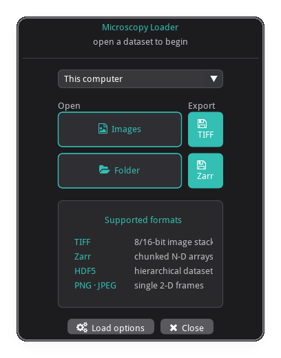
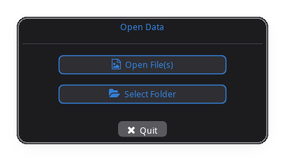
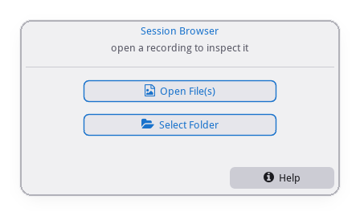

<h1 align="center">imgui_data_loader</h1>

<p align="center">
<a href="https://pypi.org/project/imgui_data_loader/"></a>
<a href="https://pypi.org/project/imgui_data_loader/"></a>
<a href="LICENSE"></a>
</p>

<samp>
<p align="center">
A configurable <b>file / folder open dialog</b> widget in python
<br>
<br>
<a href="#install">install</a> ·
<a href="#quick-start">quick start</a> ·
<a href="#examples">examples</a> ·
<a href="#configuration-reference">configuration</a> ·
<a href="https://github.com/FlynnOConnell/imgui_data_loader/issues">issues</a>
</p>
</samp>

<p align="center">
  <a href="examples/dialog_full_example.py">
    
  </a>
  <br/>
  <em>The <a href="examples/dialog_full_example.py">full example</a> — a source selector, a two-column action grid, and a formats panel.</em>
</p>

## About

Built on **imgui-file-dialog** and [imgui-bundle](https://github.com/pthom/imgui_bundle). It gives you:

- a small, styled **launcher window** — your title, help/info content, and
  buttons that open the **OS-native** picker (via `portable_file_dialogs`)
- configurable buttons — open a file, many files, a folder, or save
- customizable file-type filters, theme, an info card, and an options popup
- one-shot use that returns the picked path, or embed it as a panel in a larger app

What you can do with imgui is endless, I often take inspiration from
[this list of imgui examples](https://github.com/ocornut/imgui/issues/3488#issuecomment-698634017).

## Install

**imgui_data_loader** is on [PyPI](https://pypi.org/project/imgui_data_loader/):

```bash
pip install imgui_data_loader
```

The only dependency is `imgui-bundle` (which provides imgui, hello_imgui,
immapp, portable_file_dialogs and the FontAwesome icon font).

## Quick start

```python
from imgui_data_loader import run_file_dialog, FileDialogConfig

result = run_file_dialog(FileDialogConfig())   # default Open File(s) / Select Folder

if result:                      # truthy only for a real selection
    print(result.paths)         # list[str]
    print(result.path)          # first path, or None
else:
    print("cancelled")
```

`run_file_dialog` opens the window, blocks until the user picks something or
quits, and returns a `DialogResult`.

## Examples

See all examples in [`examples/`](examples/).

| name | file | preview |
|------|------|:-------:|
| dialog_minimal | [`dialog_minimal.py`](examples/dialog_minimal.py) | <a href="examples/dialog_minimal.py"></a> |
| dialog_full_example | [`dialog_full_example.py`](examples/dialog_full_example.py) | <a href="examples/dialog_full_example.py"></a> |
| dialog_themes | [`dialog_themes.py`](examples/dialog_themes.py) | <a href="examples/dialog_themes.py"></a> |

## Configuration reference

`FileDialogConfig` fields:

| field | default | purpose |
|-------|---------|---------|
| `title`, `subtitle` | `"Open Data"`, `""` | header text |
| `buttons` | Open File(s) + Select Folder | list of `ButtonSpec` |
| `filetypes` | `[All Files]` | default filters for file/save buttons |
| `default_dir` | `""` | picker start dir (else persistence, else `~`) |
| `theme` | `Theme.dark()` | colors |
| `header_draw` | `None` | replace the title/subtitle block |
| `top_draw` | `None` | content between header and buttons |
| `info` | `None` | callback(s) drawn in the info card |
| `options_draw` | `None` | Options popup content (also toggles the button) |
| `footer_draw` | `None` | replace the Options/Quit row |
| `options_label` | `"Options"` | popup + button label |
| `show_options_button` | `True` | show Options (needs `options_draw`) |
| `show_quit_button`, `quit_label` | `True`, `"Quit"` | Quit button |
| `quit_on_escape` | `True` | Esc cancels |
| `close_on_select` | `True` | exit the run loop after a pick or cancel (one-shot mode) |
| `window_title`, `window_size`, `resizable` | — | OS window (one-shot) |
| `ini_path` | `~/.imgui_data_loader/file_dialog.ini` | where the layout `.ini` is saved |
| `assets_folder` | `None` | folder providing the icon font; unset never overrides a host app's assets folder |
| `persistence` | `None` | a `PreferenceStore` |
| `on_select`, `on_cancel` | `None` | result callbacks |

### Draw slots

`header_draw`, `top_draw`, `info`, `options_draw`, and `footer_draw` let you
render your own content in specific regions — the header block, a row above the
buttons, the info card, the options popup, and the footer. Each runs inside a
live imgui frame, so any widget **bundled with imgui-bundle** works: animated
toggles, rotary knobs, spinners, markdown, command palettes, cool bars, and the
rest. Pair them with the library's themed helpers (`center_text`, `icon_button`,
`push_button_style`, …) and `dlg.theme` so your additions match the dialog's
styling.

## Files on disk

Everything the library writes lives under one dot directory,
`~/.imgui_data_loader/` (override the location with the
`IMGUI_DATA_LOADER_HOME` env var):

| path | written by | purpose |
|------|-----------|---------|
| `~/.imgui_data_loader/file_dialog.ini` | `run_file_dialog` | hello_imgui window layout (position/size). Override per dialog with `config.ini_path`; an embedding app's own `ini_filename` always wins. |
| `~/.imgui_data_loader/recent.json` | `JsonPreferenceStore` | recent files + last-used directories (global and per pick kind). Only written if you opt into `persistence=JsonPreferenceStore()`; pass `path=` to relocate. |
| `~/.imgui_data_loader/assets/` | you (optional) | user assets folder. Never created automatically; if it exists it is added to hello_imgui's asset search path when the icon font can't be resolved. |

Assets resolution: the dialog needs FontAwesome 6
(`fonts/Font_Awesome_6_Free-Solid-900.otf`) for its icons. `ensure_assets()`
never replaces an assets folder your app already configured — if the font
resolves, nothing is touched; otherwise `~/.imgui_data_loader/assets` and then
imgui-bundle's bundled assets are added as search paths. Passing
`config.assets_folder` explicitly *does* set the assets folder to that path.

Embedding apps with their own app dir (e.g. one that keeps everything under
`~/.myapp`) should point both knobs there: `config.ini_path` for the layout
file and a custom `PreferenceStore` (or `JsonPreferenceStore(path=...)`) for
recents — nothing then touches `~/.imgui_data_loader`.

## Notes

- Buttons open the **OS-native** dialog, so a desktop session is required (no
  in-window file browser).
- Icons come from FontAwesome 6 (**Solid** only), which ships inside
  imgui-bundle; a few non-solid glyphs render as a blank box — pick a solid icon
  if one shows empty.
- Draw callbacks run inside an active imgui frame — only call imgui from them.

## Acknowledgements

This dialog started life inside
[mbo_utilities](https://github.com/MillerBrainObservatory/mbo_utilities) at the
[Miller Brain Observatory](https://github.com/MillerBrainObservatory), where the
original file/folder loader was built.

## License

MIT
