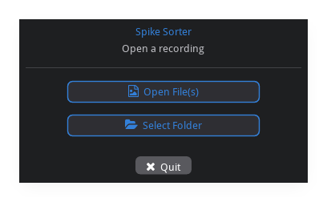
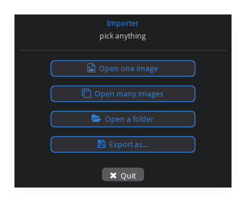
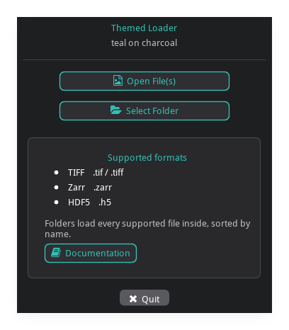
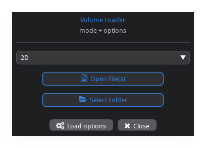
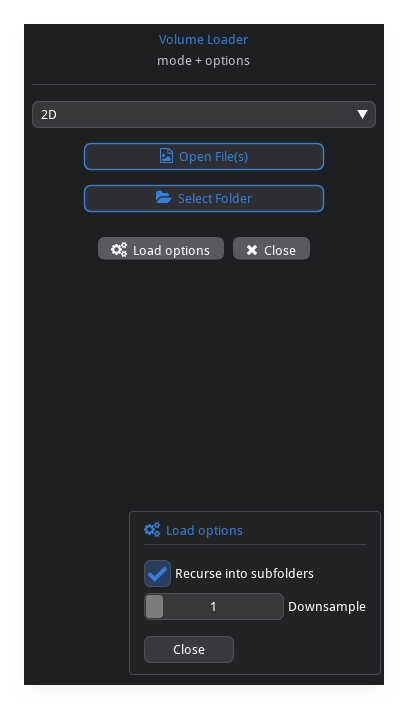
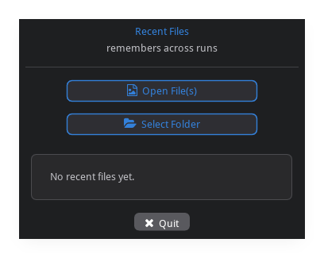
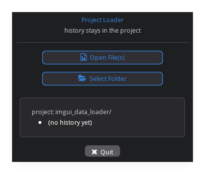
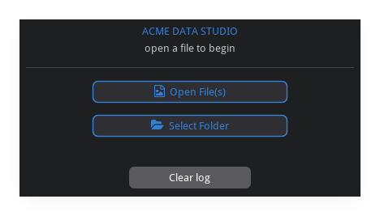

# Example gallery

Screenshots of every example, captured from the real dialogs by
`python scripts/capture_docs.py`. The ladder goes from the one-liner to a full
embedded app; each step adds options the previous one didn't. Source for each is
in [`../examples`](../examples).

## 01 — Minimal

`run_file_dialog()` with no configuration: the default Open File(s) / Select
Folder launcher.

## 02 — Branding + file types

A `title`/`subtitle`, `FileType` filters applied to the picker, and a
`default_dir`. `result.kind` tells you which button was used.

## 03 — Custom buttons

A hand-built `buttons` list covering every `PickKind` — open one file, open
many, select a folder, save-as — each with its own icon, tooltip, and filters.

## 04 — Theme + info card

A custom `Theme` (`.replace()` the accent) and an `info` card built from a list
of callbacks using the themed helpers (`center_text`, `text_wrapped_colored`,
`icon_button`).

## 05 — Content slots + options popup

`top_draw` puts a mode combo above the buttons; `options_draw` adds an Options
popup with live controls; `on_select`/`on_cancel` handle the outcome.

| dialog | options popup open |
|--------|--------------------|
|  |  |

## 06 — Recent files (built-in store)

A `JsonPreferenceStore` records selections, seeds the picker's start directory,
and feeds the recent-files list shown in the info card.

## 07 — Custom PreferenceStore

`persistence` is a three-method protocol — here backed by a project-local JSON
history that always starts the picker in the project directory.

## 08 — Embedded in your own app

The `FileDialog` widget rendered inside your own hello_imgui runner, with a
fully custom `header_draw` and `footer_draw` and `close_on_select=False` so a
pick doesn't exit the app.

